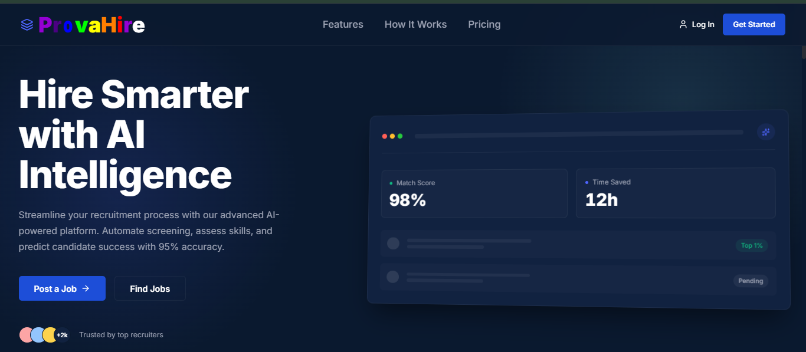
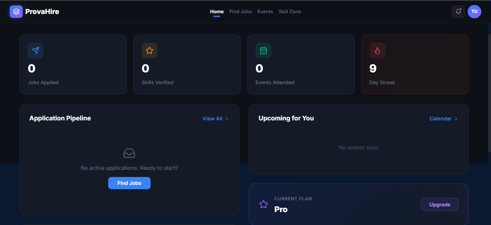
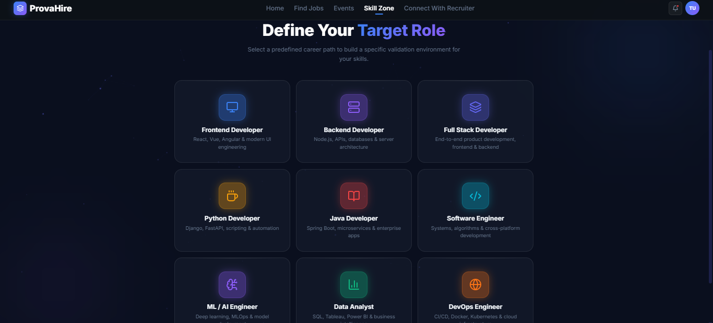
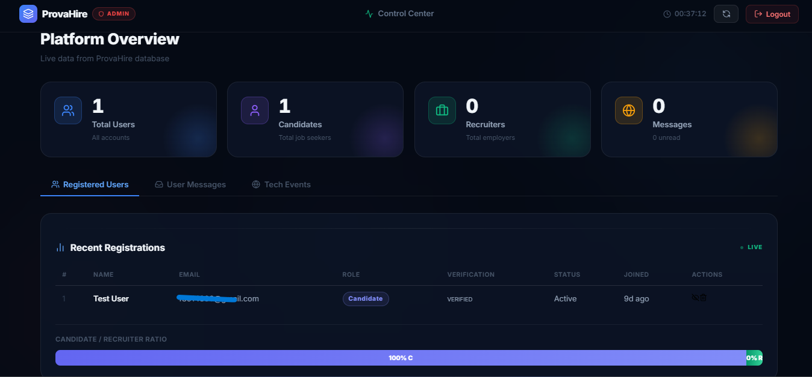
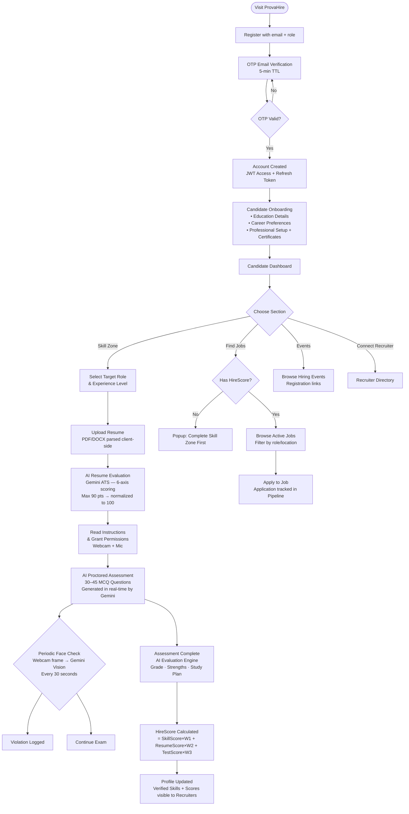
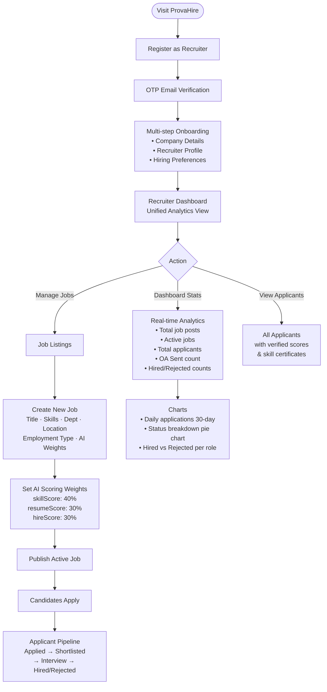
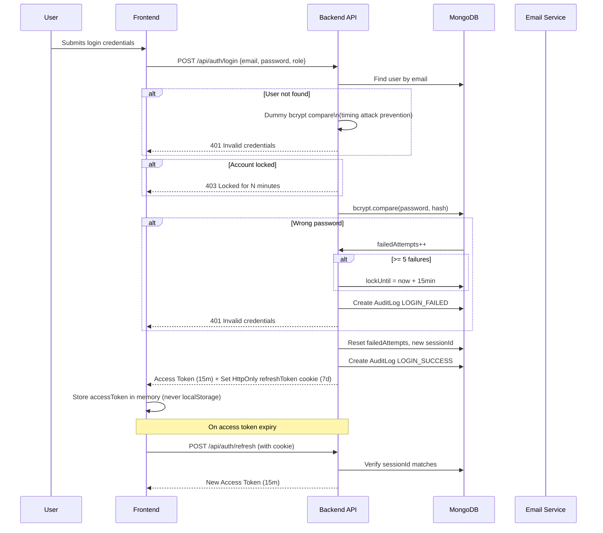

<div align="center">

<h1>🔷 ProvaHire</h1>

<p><strong>AI-Powered Intelligent Hiring Platform — Where Merit Meets Opportunity</strong></p>

[](https://react.dev)
[](https://www.typescriptlang.org)
[](https://nodejs.org)
[](https://mongodb.com)
[](https://deepmind.google/technologies/gemini/)
[](https://vitejs.dev)

> **Live Demo:** 🚀 [https://provahire.vercel.app](https://provahire.vercel.app) _backend -> https://provehire.onrender.com

</div>

---

## 📌 Table of Contents

- [What is ProvaHire?](#-what-is-provahire)
- [The Problem It Solves](#-the-problem-it-solves)
- [Why ProvaHire Over Existing Solutions](#-why-provahire-over-existing-solutions)
- [Screenshots & UI Preview](#-screenshots--ui-preview)
- [Tech Stack](#-tech-stack)
- [Architecture Diagram](#-architecture-diagram)
- [Complete Workflow](#-complete-workflow)
- [API Reference](#-api-reference)
- [Project Structure](#-project-structure)
- [Getting Started (Local Setup)](#-getting-started-local-setup)
- [Environment Variables](#-environment-variables)
- [Security Highlights](#-security-highlights)
- [Feature Roadmap](#-feature-roadmap)

---

## 🧠 What is ProvaHire?

**ProvaHire** is a full-stack, AI-first hiring platform that fundamentally reimagines how candidates and recruiters connect. It goes far beyond a simple job board by introducing an **objective, skill-verified pipeline** — powered by Google's **Gemini 2.5 Pro** — that eliminates bias, inflated resumes, and inconsistent screening.

Every candidate on ProvaHire carries a **verified Hire Score** — a composite AI-calculated metric that combines their:
- 📄 **Resume Score** (AI-evaluated ATS analysis)
- 🧪 **Skill Score** (verified through proctored technical assessments)
- 🎯 **Test Score** (role-specific deep evaluation)

Recruiters can post jobs, set **custom AI scoring weights**, and let the platform automatically surface only the most qualified — verified — candidates.

---

## 🔥 The Problem It Solves

| Pain Point | Reality Without ProvaHire |
|---|---|
| **Resume Inflation** | 78% of job seekers admit to embellishing skills on their resume |
| **Manual Screening Bottleneck** | Hiring teams spend ~23 hours screening resumes per role |
| **Bias in Shortlisting** | Unconscious bias leads to systemic exclusion of qualified candidates |
| **No Skill Verification** | LinkedIn endorsements and listed skills are completely unverified |
| **Cheating in Online Assessments** | Most platforms have no real-time proctoring beyond tab-switch detection |
| **Fragmented Hiring Workflow** | Resume, job boards, ATS, and assessment tools are all siloed |

ProvaHire addresses **all six** problems in a single, integrated platform.

---

## 🏆 Why ProvaHire Over Existing Solutions

| Feature | ProvaHire ✅ | LinkedIn | Naukri | HackerRank |
|---|:---:|:---:|:---:|:---:|
| AI Proctored Assessments (Webcam + Tab) | ✅ | ❌ | ❌ | Partial |
| AI Resume Scoring (6-axis ATS) | ✅ | ❌ | ❌ | ❌ |
| Verified Hire Score for every candidate | ✅ | ❌ | ❌ | ❌ |
| Recruiter-configurable AI Weights | ✅ | ❌ | ❌ | ❌ |
| Full Auth Security (lockout, history, session) | ✅ | Partial | Partial | Partial |
| Role-based application access gate | ✅ | ❌ | ❌ | ❌ |
| Admin platform oversight | ✅ | N/A | N/A | Partial |
| End-to-end single platform (no integrations) | ✅ | ❌ | ❌ | ❌ |
| Real-time application pipeline analytics | ✅ | ❌ | ❌ | ❌ |

---

## 🖼 Screenshots & UI Preview

> _Screenshots below are from the live development build._

| Landing Page | Candidate Dashboard |
|---|---|
|  |  |

| Skill Zone Assessment | 
|---|---|
|  | 

| Admin Panel | 
|---|---|
|  | 

> 📸 _Add screenshots to a `/screenshots` folder in the project root to display them here._

---

## 🛠 Tech Stack

### Frontend
| Technology | Version | Purpose |
|---|---|---|
| **React** | 19.2 | UI Framework |
| **TypeScript** | 5.9 | Type Safety |
| **Vite** | 8.0 (beta) | Build Tool & Dev Server |
| **Recharts** | 3.7 | Analytics Charts & Visualizations |
| **Lucide React** | 0.575 | Icon system |
| **@tanstack/react-table** | 8.21 | Advanced data tables (Admin) |
| **pdfjs-dist** | 5.4 | Client-side PDF parsing for resume upload |
| **mammoth** | 1.11 | DOCX parsing for resume upload |
| **Vanilla CSS** | — | All styles (no utility framework) |

### Backend
| Technology | Version | Purpose |
|---|---|---|
| **Node.js + Express** | 5.2 | REST API Server |
| **MongoDB + Mongoose** | 9.2 | Primary Database |
| **JSON Web Tokens (JWT)** | 9.0 | Access (15m) + Refresh (7d) token auth |
| **bcryptjs** | 3.0 | Password hashing with salt rounds |
| **Nodemailer** | 8.0 | Transactional OTP & notification emails |
| **Helmet** | 8.1 | HTTP Security Headers |
| **express-rate-limit** | 8.2 | API Rate Limiting |
| **xss-clean** | 0.1 | XSS Attack Prevention |
| **hpp** | 0.2 | HTTP Parameter Pollution Prevention |
| **express-validator** | 7.3 | Input Validation |
| **cookie-parser** | 1.4 | HttpOnly cookie management |

### AI / Intelligence Layer
| Technology | Purpose |
|---|---|
| **Google Gemini 2.5 Pro** | Question generation, assessment evaluation, resume scoring, face proctoring |
| **AstraEval Engine** | Custom batched question generation with JSON repair + retry logic |
| **Webcam API** | Real-time frame capture for face presence detection |

---

---

## 🔄 Complete Workflow

### 👤 Candidate Journey



### 🏢 Recruiter Journey



### 🔐 Authentication Security Flow



---

## 🗄 Data Models

### User (Candidate)
```
User {
  fullName, email, password (hashed)
  role: 'candidate' | 'recruiter'
  isVerified, isBlocked
  sessionId, ipAddress, userAgent, lastActive
  failedLoginAttempts, lockUntil
  passwordHistory[5]          // Prevent reuse of last 5 passwords
  onboardingDone
  
  // Skill Zone AI Metrics
  targetRole
  verifiedSkills[]: { skillName, score, verifiedAt }
  scores: { resumeScore, skillScore, testScore, hireScore }
  assessmentHistory[]: { testName, testType, score, passed, violations }
  
  // Profile
  education: { degree, university, passingYear }
  careerPreferences: { engagement, preferredRole, location, industries }
  certificates[]: { name, link, fileName }
  subscriptionPlan: Free | Basic | Pro | Elite
}
```

### Job
```
Job {
  recruiter: ObjectId(Recruiter)
  title, department, location
  employmentType: Full-time | Part-time | Contract | Internship
  experienceRange: 0-1yr | 1-3yrs | 3-5yrs | 5-8yrs | 8+yrs
  description, skills[]
  status: Draft | Active | Closed
  aiWeights: { skillScore: 40, resumeScore: 30, hireScore: 30 }
  lastDateToApply, postedAt
}
```

### Application
```
Application {
  candidate: ObjectId(User)
  job: ObjectId(Job)
  status: Applied | Shortlisted | Interview | Hired | Rejected
  appliedAt
}
```

---

## 📁 Project Structure

```
provahire/
├── backend/                        # Node.js + Express REST API
│   ├── server.js                   # Entry point, middleware setup
│   ├── config/
│   │   └── db.js                   # MongoDB connection
│   ├── controllers/
│   │   ├── authController.js       # Register, OTP, Login, Reset, Refresh
│   │   ├── recruiterAuthController.js  # Recruiter auth + onboarding
│   │   ├── recruiterController.js  # Jobs, applicants, dashboard stats
│   │   ├── adminController.js      # User management, events, block/unblock
│   │   └── geminiController.js     # Gemini 2.5 Pro API proxy
│   ├── models/
│   │   ├── User.js                 # Candidate schema (full AI metrics)
│   │   ├── Recruiter.js            # Recruiter profile schema
│   │   ├── Job.js                  # Job posting schema + AI weights
│   │   ├── Application.js          # Job application + pipeline status
│   │   ├── OTP.js                  # Email OTP with TTL index
│   │   ├── AuditLog.js             # Security event audit trail
│   │   ├── Event.js                # Platform events (admin-managed)
│   │   └── PasswordResetToken.js   # Password reset tokens
│   ├── middleware/
│   │   ├── authMiddleware.js       # JWT verify + session check
│   │   └── recruiterMiddleware.js  # Recruiter-specific JWT guard
│   ├── routes/
│   │   ├── authRoutes.js
│   │   ├── recruiterAuthRoutes.js
│   │   ├── recruiterRoutes.js
│   │   ├── candidateRoutes.js
│   │   ├── adminRoutes.js
│   │   ├── geminiRoutes.js
│   │   └── eventRoutes.js
│   └── utils/
│       └── sendEmail.js            # Nodemailer email utility
│
└── frontend/                       # React 19 + TypeScript + Vite
    ├── index.html
    ├── vite.config.ts
    ├── src/
    │   ├── App.tsx                 # Hash-based router (17+ routes)
    │   ├── main.tsx                # React root + auth bootstrap
    │   ├── index.css
    │   │
    │   ├── pages/
    │   │   ├── Register.tsx        # Multi-role registration
    │   │   ├── OTP.tsx             # 6-digit OTP verification
    │   │   ├── Login.tsx           # Role-gated login
    │   │   ├── ForgotPassword.tsx  # OTP-based password reset
    │   │   ├── ConfirmationPage.tsx # Post-register confirmation
    │   │   ├── Dashboard.tsx       # Candidate main dashboard
    │   │   ├── FindJobs.tsx        # Job board with HireScore gate
    │   │   ├── EventsPage.tsx      # Hiring events listing
    │   │   ├── ConnectRecruiter.tsx # Recruiter directory
    │   │   ├── CandidateProfile.tsx # Full candidate profile view
    │   │   ├── RecruiterOnboarding.tsx # 4-step recruiter setup
    │   │   ├── RecruiterDashboard.tsx  # Recruiter hub
    │   │   ├── AdminLogin.tsx      # Admin passkey login
    │   │   ├── AdminDashboard.tsx  # Full platform admin panel
    │   │   ├── JobListingsPage.tsx # Recruiter job management
    │   │   ├── PostNewJobPage.tsx  # Job creation form
    │   │   └── candidate/
    │   │       └── SkillZone/
    │   │           ├── index.tsx       # Skill zone hub
    │   │           ├── Experience.tsx  # Role + experience selection
    │   │           ├── ResumeUpload.tsx # PDF/DOCX upload + AI eval
    │   │           ├── Instructions.tsx # Pre-exam instructions
    │   │           ├── Permissions.tsx  # Webcam/mic grant
    │   │           ├── Assessment.tsx   # Proctored MCQ exam
    │   │           └── Result.tsx       # AI-generated analysis
    │   │
    │   ├── components/
    │   │   ├── Header.tsx          # Landing page nav
    │   │   ├── Hero.tsx            # Landing hero section
    │   │   ├── Features.tsx        # Feature highlights
    │   │   ├── HowItWorks.tsx      # Step-by-step guide
    │   │   ├── PricingSection.tsx  # Subscription tiers
    │   │   ├── Stats.tsx           # Platform stats
    │   │   ├── CTASection.tsx      # Call to action
    │   │   ├── ContactSection.tsx  # Contact form
    │   │   ├── Footer.tsx
    │   │   ├── CandidateHeader.tsx # Authenticated nav
    │   │   ├── EducationDetails.tsx # Onboarding step
    │   │   ├── CareerPreferences.tsx # Onboarding step
    │   │   ├── ProfessionalSetup.tsx # Cert + consent step
    │   │   ├── SkillsSection.tsx   # AI skill viewer
    │   │   ├── ResumeUpload.tsx    # Shared resume component
    │   │   ├── PasswordChecklist.tsx # Real-time pw strength
    │   │   ├── FilterDropdown.tsx
    │   │   ├── Recruiter/          # Recruiter dashboard widgets
    │   │   ├── jobs/               # Job card + detail components
    │   │   └── ui/                 # Shared UI primitives
    │   │
    │   ├── services/
    │   │   ├── geminiAssessment.ts # AstraEval Engine (AI service layer)
    │   │   └── api.ts              # Axios/Fetch API helper
    │   │
    │   ├── hooks/                  # Custom React hooks
    │   ├── context/                # React Context providers
    │   ├── types/
    │   │   ├── assessment.types.ts # Question, AssessmentResult, Violation
    │   │   └── index.ts
    │   └── utils/
    │       ├── profileStore.ts     # In-memory auth + profile state
    │       └── ...
```

---

## 🚀 Getting Started (Local Setup)

### Prerequisites
- **Node.js** v18+ (native `fetch` required for Gemini API calls)
- **MongoDB** (local or [MongoDB Atlas](https://www.mongodb.com/cloud/atlas) free tier)
- **Google Gemini API Key** ([Get one here](https://aistudio.google.com/app/apikey))
- **SMTP credentials** (Gmail with App Password, or any SMTP provider)

### 1. Clone the Repository

```bash
git clone https://github.com/your-username/provahire.git
cd provahire
```

### 2. Backend Setup

```bash
cd backend
npm install
```

Create a `.env` file (see [Environment Variables](#-environment-variables) section below).

```bash
node server.js
# Server running on port 5000
```

### 3. Frontend Setup

```bash
cd ../frontend
npm install
npm run dev
# Vite dev server at http://localhost:5173
```

### 4. Open in Browser

Navigate to `http://localhost:5173` — you'll see the ProvaHire landing page.
click 10-times on logo and access Admin Panel
---

## 🔑 Environment Variables

### Backend (`backend/.env`)

```env
# Server
PORT=5000
NODE_ENV=development

# Database
MONGO_URI=mongodb+srv://<user>:<password>@cluster.mongodb.net/provahire

# JWT
JWT_SECRET=your_super_secret_jwt_key_here_min_32_chars

# Google Gemini AI
GEMINI_API_KEY=your_google_gemini_api_key

# Email (Nodemailer)
EMAIL_HOST=smtp.gmail.com
EMAIL_PORT=587
EMAIL_USER=your_gmail@gmail.com
EMAIL_PASS=your_gmail_app_password
```

### Frontend (`frontend/.env`)
```env
VITE_API_BASE_URL=http://localhost:5000
VITE_ADMIN_ID=ProvaHire
VITE_ADMIN_KEY=Hire123,  Use adn test this key for admin
```

---

## 🔒 Security Highlights

ProvaHire implements **enterprise-grade security** at every layer:

| Security Feature | Implementation |
|---|---|
| **Password Hashing** | bcrypt with 10 salt rounds on every save |
| **Password History** | Last 5 passwords stored — reuse prevented |
| **Account Lockout** | 5 failed attempts → 15-minute lockout |
| **Timing Attack Prevention** | Dummy bcrypt compare on non-existent users |
| **Session Invalidation** | UUID session IDs — rotating on login, logout, password reset |
| **Token Strategy** | Access Token (15min, in-memory) + Refresh Token (7d, HttpOnly cookie) |
| **Role Isolation** | Login/OTP endpoint rejects mismatched role+credential pairs |
| **HTTP Security Headers** | Helmet.js — CSP, HSTS, X-Frame-Options, XSS protection |
| **XSS Prevention** | xss-clean middleware on all req.body/query/params |
| **HTTP Param Pollution** | hpp middleware preventing duplicate parameter injection |
| **Rate Limiting** | express-rate-limit on all public endpoints |
| **Input Validation** | express-validator on all incoming request payloads |
| **Audit Trail** | All security events logged to AuditLog collection with IP + UA |
| **OTP Expiry** | OTPs use MongoDB TTL index — auto-deleted after 5 minutes |
| **XSS in Assessment** | Webcam + face proctoring with suspension on violations |

---

## 🤖 AI / AstraEval Engine Details

The `geminiAssessment.ts` service is the brain of ProvaHire's candidate evaluation:

### Question Generation
- Sends **batched prompts** (5 questions per batch) to `gemini-2.5-pro`
- Uses **schema-driven zero-shot prompts** for deterministic JSON output
- Built-in **JSON repair utility** (`repairJson`) handles truncated responses
- **Exponential backoff retry** (2 attempts) for reliability
- Supports both `theory` and `code` question types with 4 options each

### Assessment Evaluation
- Post-exam AI analysis acts as a **Senior Engineering Hiring Manager at FAANG**
- Generates: Grade (A+ to F), topic-wise breakdown, strengths, weaknesses, recommendation (Hire/Maybe/Reject), AI verdict, study plan
- **Integrity Score** (0–100): deducts points for proctoring violations

### Resume Scoring (6-Axis ATS)
| Axis | Max Points |
|---|---|
| Role Alignment | 15 |
| Skill Depth Proof | 15 |
| Project Authenticity | 20 |
| GitHub/Portfolio Verification | 15 |
| Modern Industry Trends | 15 |
| Resume Structure & Grammar | 10 |
| **Total** | **90 → normalized to 100%** |

### Face Proctoring
- Sends base64 webcam frames to Gemini Vision every ~30 seconds
- Detects: `faceDetected`, `multipleFaces`, `lookingAway`, `suspicious`
- Violations are logged per assessment and factored into integrity score
- Graceful fallback on failed frames — never crashes the exam

---

## 📊 Feature Roadmap

| Status | Feature |
|---|---|
| ✅ Done | Multi-role registration with OTP email verification |
| ✅ Done | JWT access + refresh token auth with session tracking |
| ✅ Done | Candidate onboarding (education, career prefs, certificates) |
| ✅ Done | AI-proctored skill assessment (Gemini MCQ + face detection) |
| ✅ Done | AI resume scoring (6-axis ATS evaluation) |
| ✅ Done | Hire Score calculation and profile display |
| ✅ Done | Recruiter onboarding (company + hiring profile) |
| ✅ Done | Job posting with AI weight configuration |
| ✅ Done | Applicant pipeline management (Applied → Hired) |
| ✅ Done | Recruiter analytics dashboard (charts, daily stats) |
| ✅ Done | Admin panel (user management, block/unblock, events) |
| ✅ Done | Platform events listing |
| ✅ Done | Find Jobs page with HireScore access gate |
| 🔄 In Progress | Stripe subscription integration (Free/Basic/Pro/Elite) |
| 🔄 In Progress | Production deployment (Vercel + Render/Railway) |
| 📋 Planned | Real-time notifications (WebSocket) |
| 📋 Planned | Candidate–Recruiter direct messaging |
| 📋 Planned | AI-generated interview question bank per job |
| 📋 Planned | GitHub activity integration for skill verification |

---

## 👨‍💻 Author

Built with ❤️ by **Anupam Kumar Pandit** — Full Stack Developer

---

## 📄 License

This project is licensed under the **MIT License** — feel free to use, modify, and distribute.

---

<div align="center">

**⭐ Star this repo if ProvaHire impressed you!**

_Making hiring fair, fast, and fully verified — one AI interaction at a time._

</div>
